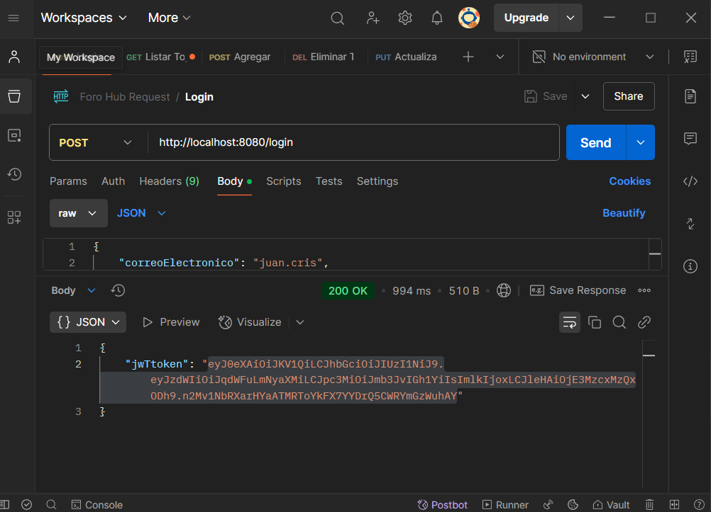
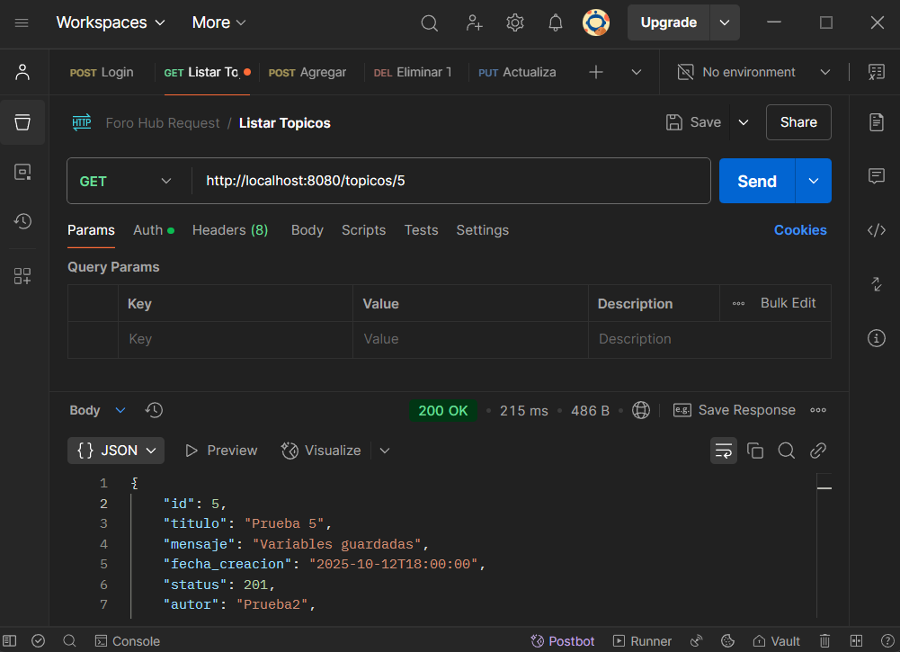

# Alura Latam - Oracle ONE - Backend

# Table of Contents

- [Overview](#overview)
- [Screenshot](#screenshot)
- [My process](#my-process)
- [Built with](#built-with)
- [Java Project with Spring Boot](#java-project-with-spring-boot)
- [Requirements](#requirements) - [Dependencies](#dependencies)
- [Build Configuration](#build-configuration)
- [Project Features](#project-features)
- [Summary](#summary) - [What I learned](#what-i-learned)
- [Author](#author) - [Course](#course)

## Overview

### Screenshot

#### Post Login



#### Get Listar Id



## My process

### Built with

## Java Project with Spring Boot

### Requirements

- Java 17

### Dependencies

These are the dependencies used in the project:

- `org.springframework.boot:spring-boot-starter-web`
- `org.springframework.boot:spring-boot-devtools` (runtime, optional)
- `org.projectlombok:lombok` (optional)
- `org.springframework.boot:spring-boot-starter-test` (test)
- `org.springframework.boot:spring-boot-starter-data-jpa`
- `org.flywaydb:flyway-core`
- `org.flywaydb:flyway-mysql`
- `com.mysql:mysql-connector-j` (runtime)
- `org.springframework.boot:spring-boot-starter-validation`
- `org.springframework.boot:spring-boot-starter-security`
- `com.auth0:java-jwt:4.3.0`
- `org.springdoc:springdoc-openapi-starter-webmvc-ui:2.8.1`

### Build Configuration

The project uses the Maven plugin for Spring Boot:

```xml

<build>
    <plugins>
        <plugin>
            <groupId>org.springframework.boot</groupId>
            <artifactId>spring-boot-maven-plugin</artifactId>
        </plugin>
    </plugins>
</build>
```

## Project Features

1. **Database Storage**: The project uses MySQL for storing data.
2. **Database Interaction**: It interacts with the database using Spring Data JPA.
3. **Postman-Based**: All interactions and operations are performed through Postman.

### Summary

This project is designed to create and manage discussion forums for
programming-related issues. It leverages MySQL for robust data storage
and utilizes Spring Data JPA for seamless database interactions.
The application employs JWT (JSON Web Tokens) for secure user authentication
and is complemented by Spring Security for enhanced security features.
All interactions and operations are performed through Postman, providing a
straightforward and user-friendly interface for managing forum-related operations.

### What I learned

I learned how to create an application from scratch, having clarity on each of the
functions such as classes, DTO, repository, and controller. It is worth noting that
this was a significant challenge for me, and the topic of Security was my biggest
hurdle, but it was accomplished.

## Author

- Website - [Juan Pablo Cristancho](https://my-portafolio-mygi-dvu8swsn6-juan-cris-projects.vercel.app)

## Course

- [Oracle ONE](https://my-portafolio-mygi-dvu8swsn6-juan-cris-projects.vercel.app)
- [Alura](https://www.linkedin.com/company/alura-latam/mycompany/)

